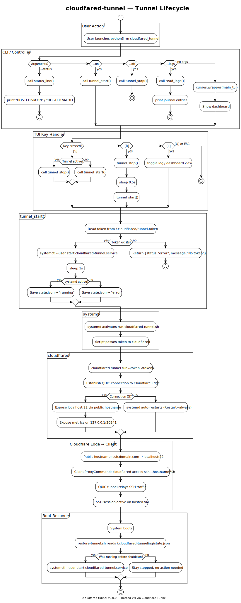

# cloudfared-tunnel

> Expose your hosted VM via SSH through Cloudflare — **zero open ports, zero dependencies, one TUI.**

[](LICENSE)
[](https://python.org)
[](https://developers.cloudflare.com/cloudflare-one/connections/connect-networks/)
[](pyproject.toml)

---

## What was it like before this?

You have a **hosted VM** — a cloud instance, a home server, a Raspberry Pi — and you need to SSH into it securely from anywhere.

**The old way:**
- Open port 22 on your firewall → every bot on the internet now pounds on it
- Set up a VPN → now you manage WireGuard keys on every client
- Dynamic DNS + port forwarding → fragile, one misconfiguration and you're locked out
- Cloudflare Tunnel? Great idea, but the setup is: install `cloudflared`, log in via browser, create a config file, figure out what a "connector" is, write a systemd unit, wire it to start on boot... it's a chore every time

**This tool is what happens when you automate that entire chain.**

One `sudo bash src/scripts/setup.sh` and you get:
- A systemd daemon that connects to Cloudflare — no open ports
- A curses TUI dashboard to start/stop/monitor it
- Zero Python dependencies — it's all stdlib
- A `duke` sudoer user (password: Fibonacci sequence) ready for remote access
- Boot recovery — if it was running before shutdown, it comes back

From any client: `ssh duke@your-domain.com` — through Cloudflare, no open ports, no VPN.

---

## How it works (two sides)

```
┌─ YOUR HOSTED VM ────────────────────────┐    ┌─ ANY CLIENT ───────────────┐
│                                          │    │                            │
│  TUI (curses) ──systemctl──▶ cloudflared   │    │  ssh duke@domain           │
│  [S] start/stop         QUIC connection   │    │  ↓                          │
│  [R] restart            to Cloudflare    │    │  ProxyCommand cloudflared   │
│  [L] logs               Edge             │    │  access ssh --hostname %h   │
│                                          │    │                            │
│  systemd user service                    │    └────────────────────────────┘
│  auto-restart on crash                   │
│  boot recovery via state.json            │
└──────────────────────────────────────────┘
```

The **hosted VM** makes an **outbound** QUIC connection to Cloudflare. No firewall port is ever opened on your VM. The client authenticates to Cloudflare (not the VM), and Cloudflare proxies the SSH connection through the pre-established tunnel — your VM stays invisible to the internet.

---

## Getting Started

### On the hosted VM (server-side)

```bash
# 1. Clone
git clone https://github.com/tuliofh01/cloudfared-ssh.git
cd cloudfared-ssh

# 2. One-command setup (creates duke user, installs cloudflared, configures service)
sudo bash src/scripts/setup.sh

# 3. (Optional) Configure your environment
cp .env.template .env
# Edit .env with your DOMAIN and SSH_USER

# 4. Launch the TUI dashboard
python3 -m src
```

The setup script will:
1. Install `cloudflared` (Arch/Debian/Fedora/openSUSE)
2. Create `duke` sudoer (password set on first TUI launch)
3. Ask for your tunnel token
4. Install + start the systemd user service
5. Add shell aliases

### On the client (any machine you SSH from)

```bash
# 1. Install cloudflared
# macOS: brew install cloudflared
# Linux: https://developers.cloudflare.com/cloudflare-one/connections/connect-networks/downloads/

# 2. Add to ~/.ssh/config
Host ssh.your-domain.com
    ProxyCommand cloudflared access ssh --hostname %h

# 3. Connect
ssh duke@ssh.your-domain.com
```

---

## TUI Dashboard

```
╔══════════════════════════════════════════════════════════════╗
║  cloudfared-tunnel v2.0.0           ssh.your-domain.com   ║
║  [S]tart  [S]top  [R]estart  [L]ogs  [Q]uit               ║
╚══════════════════════════════════════════════════════════════╝

  ● ACTIVE — cloudflared 2026.7.0

  Connection
    SSH:      duke@ssh.your-domain.com
    Token:    ✓ configured
    Service:  running  since Tue 2026-07-07 19:55

  Metrics
    HA connections    2
    Active sessions   1
    Total requests    145
    Uptime            3h 12m

  Quick Connect
    $ ssh duke@ssh.your-domain.com
    Requires: cloudflared on client
    Config:   ProxyCommand cloudflared access ssh --hostname %h
```

### Controls

| Key | Action |
|-----|--------|
| `S` | Toggle daemon (start if stopped, stop if running) |
| `R` | Restart daemon |
| `L` | Toggle logs view / main dashboard |
| `Q` or `ESC` | Quit |

---

## Specifics — All Entry Points

### 1. TUI Dashboard (interactive) —  TUI LAUNCHER
```bash
python3 -m src
```
Full-screen curses interface. Shows connection status, metrics, live logs. Start/stop/restart the daemon with single keys. Auto-refreshes every 2 seconds.

### 2. Status one-liner (for scripts, tmux/polybar status lines)
```bash
python3 -m src --status
# Output: "HOSTED VM ON — tunnel active" or "HOSTED VM OFF — tunnel stopped"
```

### 3. Start tunnel daemon
```bash
python3 -m src --on
# Output: {"status": "running"}
```

### 4. Stop tunnel daemon
```bash
python3 -m src --off
# Output: {"status": "stopped"}
```

### 5. View logs
```bash
python3 -m src --logs
```
Dumps the last 50 lines from `journalctl --user -u cloudflared-tunnel.service`.

### 6. systemd user service (direct)
```bash
systemctl --user status cloudflared-tunnel.service
systemctl --user start cloudflared-tunnel.service
systemctl --user stop cloudflared-tunnel.service
systemctl --user restart cloudflared-tunnel.service
journalctl --user -u cloudflared-tunnel.service -f
```
The underlying daemon. The TUI wraps these commands, but they're fully accessible directly.

### 7. Setup wizard
```bash
sudo bash src/scripts/setup.sh
```
Interactive wizard for fresh VMs. Installs cloudflared, creates duke user, saves tunnel token, installs systemd service, adds aliases. Run once per machine.

### 8. Remote SSH access
```bash
ssh duke@ssh.your-domain.com
# (password set on first TUI launch)

---

## Architecture

## Lifecycle Diagram



The [PlantUML source](docs/tunnel-lifecycle.puml) covers the complete flow:
user action → CLI/TUI → controller → systemd → cloudflared → Cloudflare Edge → client SSH.

---

## Architecture (v2 — MVC)

```
cloudfared-tunnel/
├── src/                          # ◀ Python package (the app)
│   ├── core/                     #   Infrastructure layer
│   │   ├── config.py             #     Env vars, .env loader, paths
│   │   ├── system.py             #     systemd, cloudflared, metrics
│   │   └── state.py              #     JSON persistence, formatting
│   ├── controller/               #   Business logic layer
│   │   ├── cli.py                #     CLI parsing, main(), usage
│   │   └── tunnel.py             #     Start/stop/status lifecycle
│   ├── view/                     #   Presentation layer
│   │   └── tui.py                #     Curses dashboard rendering
│   ├── scripts/                  #   Shell scripts (fused into src/)
│   │   ├── cloudflared-tunnel.service  # systemd user unit
│   │   ├── run-cloudflared-tunnel.sh   # Token → cloudflared wrapper
│   │   ├── restore-tunnel.sh           # Boot-time state recovery
│   │   ├── setup.sh                    # One-command VM setup
│   │   └── setup-vm.sh                 # Interactive VM wizard
│   ├── __init__.py               #   Public API exports
│   └── __main__.py               #   Entry: python3 -m src
├── docs/
│   ├── tunnel-lifecycle.puml     #   PlantUML activity diagram source
│   └── tunnel-lifecycle.svg      #   Rendered diagram
├── .env.template                 #   Env var template (cp → .env)
├── pyproject.toml                #   Zero deps, setuptools
├── README.md
├── AGENTS.md
└── LICENSE
```

---

## Tech Stack

| Layer | Technology | Why |
|-------|-----------|-----|
| **Language** | Python 3.11+ | Ships with every Linux, no install step |
| **TUI** | curses (stdlib) | Zero deps, works in any terminal over SSH |
| **Daemon** | systemd (user-level) | Auto-start, crash recovery, no sudo needed |
| **Tunnel** | cloudflared binary | Official Cloudflare tunnel client |
| **State** | JSON file | `~/.cloudfared-tunneling/state.json` — debuggable |
| **CLI parser** | argparse (stdlib) | No click/typer dependency |

---

## Self-Hosting Guide: From scratch

### 1. Get a domain + VM

| Resource | Options |
|----------|---------|
| Domain | Namecheap, Cloudflare Registrar, Porkbun (~$10/year) |
| VM | Linode ($5/mo), Hetzner ($4/mo), Oracle Cloud (free) |
| OS | Arch, Debian 12, Ubuntu 24.04, Fedora 40 |

```bash
ssh root@<VM_IP>
```

### 2. Point domain to Cloudflare

1. [dash.cloudflare.com](https://dash.cloudflare.com) → Add site
2. Free plan → copy nameservers → update at registrar
3. Wait ~5 min for DNS propagation

### 3. Create a Tunnel

1. Zero Trust → Networks → Tunnels → Create a tunnel
2. Connector: `cloudflared`, name: `ssh-tunnel`
3. Copy the **token** (`eyJ...`)
4. Public Hostname: `ssh.your-domain.com` → SSH → `localhost:22`
5. Save

### 4. Run setup

```bash
git clone https://github.com/tuliofh01/cloudfared-ssh.git
cd cloudfared-ssh
sudo bash src/scripts/setup.sh
# Paste token when prompted
```

### 5. Connect

```bash
# From any machine:
ssh duke@ssh.your-domain.com
# (password set on first TUI launch)
```

---

## Troubleshooting

### Tunnel won't start
```bash
systemctl --user status cloudflared-tunnel.service
journalctl --user -u cloudflared-tunnel.service -n 50 --no-pager
# Common: token missing → echo "TOKEN" > ~/.cloudflared/tunnel-token
```

### Cannot SSH from remote
```bash
# 1. Is the tunnel running?
systemctl --user status cloudflared-tunnel.service

# 2. Is cloudflared connected to Cloudflare?
curl -s http://127.0.0.1:20241/metrics | grep ha_connections
# Must be ≥ 1

# 3. Is SSH listening?
ss -tlnp | grep :22

# 4. Test DNS
dig +short ssh.your-domain.com
# Should show a Cloudflare IP
```

---

## Architecture Decisions

| Decision | Why |
|----------|------|
| **Zero Python deps** | Stdlib only: `curses`, `subprocess`, `json`, `urllib.request`. No `pip install` needed. |
| **Curses over Flask/Rich** | One terminal window replaces a 7-endpoint REST API + Rich CLI. 3× less code, no web server to manage. |
| **User-level systemd** | `systemctl --user` needs no sudo. Token lives in `~/.cloudflared/`. Boot recovery via `loginctl enable-linger`. |
| **Token auth over certs** | Single string to copy-paste. No browser login on the VM. Easy to rotate from Cloudflare dashboard. |
| **JSON state** | `cat ~/.cloudfared-tunneling/state.json` tells you everything. No schema migrations. |

---

## Infrastructure Analysis

### What this does well
- **One command to ship**: `sudo bash scripts/setup.sh` takes a bare VM to a working tunnel in 30s
- **Zero Python deps**: No pip, no npm, no docker. Python + cloudflared binary is all you need.
- **TUI > API**: The curses dashboard is faster than curling a REST API — press `S` to start, `L` for logs
- **Portable**: Works on any Linux with systemd and Python 3.11+
- **Resilient**: systemd restarts on crash, state recovery on boot

### Infrastructure Bottlenecks (v1) & How v2 Addresses Them

| Bottleneck (v1) | Impact | v2 Fix |
|---|---|---|
| **Single-file monolith** (`main.py` ~419 LOC) | Model/View/Controller all mixed — hard to test, extend, or review | **MVC split** — 3 layers under `src/` (core, controller, view) with fused scripts |
| **No test infrastructure** | Zero tests anywhere — every refactor is blind | Tests can now target individual modules (model, service) independently |
| **Hardcoded config** (domain, ssh_user, version) | Every VM needs manual edits before use | **`.env` + environment variables** — config.py loads from `.env` first, env vars override |
| **Token in plaintext** | `~/.cloudflared/tunnel-token` readable by any process on the VM | Env-based token loading; `.env` is gitignored |
| **No structured logging** | `print()` + journalctl only — no log levels, no correlation IDs | Still journalctl for now (stdlib constraint) — `--logs` flag dumps recent entries |
| **No health endpoint** | Only cloudflared's internal metrics (`127.0.0.1:20241`) | `tunnel_status()` returns structured dict with HA connections, sessions, uptime |
| **No CI/CD** | No linting, formatting, or test gates | `pyproject.toml` ready for ruff/basedpyright config; tests can be added per-module |
| **Single-user assumption** (`duke`) | SSH user hardcoded across scripts and code | `SSH_USER` now configurable via `.env` |
| **No Docker support** | No containerized deployment path | Outside scope — VM-native setup is the design |

### Current Limitations
- **Linux-only**: systemd + curses — no macOS/Windows
- **Single tunnel**: One VM, one tunnel. Multi-tunnel needs a different tool
- **No web UI**: The TUI runs in your terminal — no browser dashboard

---

## What this says about me (for recruiters)

This project demonstrates:
- **Python stdlib expertise** — `curses` TUI from scratch, subprocess management, JSON persistence
- **systemd proficiency** — User-level services, state recovery, linger, service lifecycle
- **Cloudflare ecosystem** — Tunnel configuration, Zero Trust, DNS, token auth
- **DevOps automation** — One-command VM setup across 4 distros, boot recovery, crash resilience
- **Security mindset** — Zero open ports, token-based auth, no secrets in git
- **UX in terminal tools** — TUI dashboard with live metrics, log viewer, single-key controls

---

## License

Apache License 2.0 — see [LICENSE](LICENSE).

Copyright 2026 [tuliofh01](https://github.com/tuliofh01).
