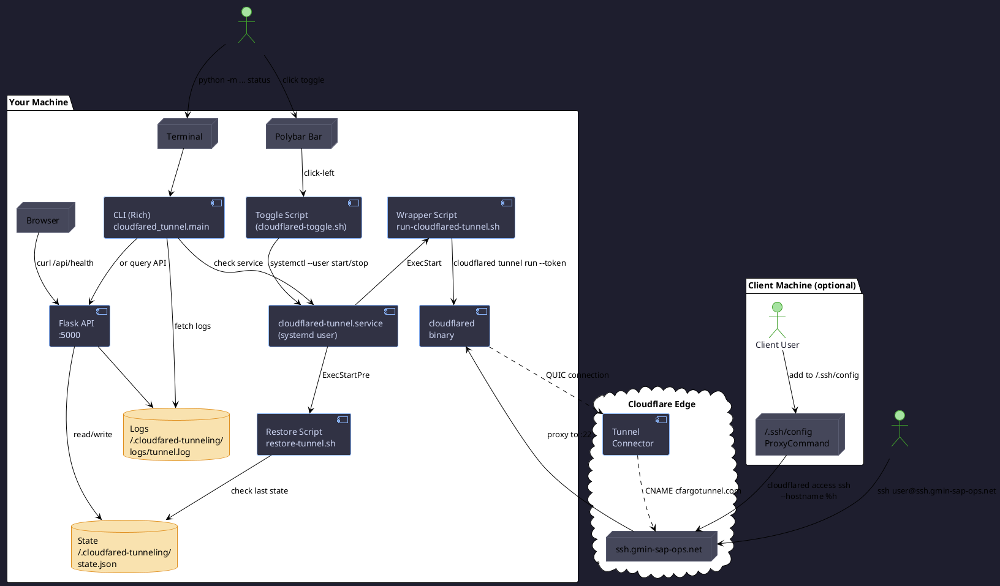

# cloudfared-tunneling

> **Cloudflare Tunnel Manager** — Python CLI + REST API + Polybar toggle + systemd auto-recovery for Cloudflare Tunnels.

[](LICENSE)
[](https://python.org)
[](https://developers.cloudflare.com/cloudflare-one/connections/connect-networks/)
[](https://flask.palletsprojects.com)
[](https://rich.readthedocs.io)
[](tests/test_all.py)
[](docker-compose.yml)
[](#polybar-toggle)
[](#state-persistence)
[](wizard.sh)

[ Leia em Português](https://translate.google.com/translate?sl=en&tl=pt&u=https://github.com/tuliofh01/cloudfared-ssh)

---

## Tabela de Conteúdo

- [What is this?](#what-is-this)
- [When to use it](#when-to-use-it)
- [Architecture & Process Flow](#architecture--process-flow)
- [Quick Start](#quick-start)
- [SSH: Expose your machine to the internet](#ssh-expose-your-machine-to-the-internet)
- [Docker + ELK Log Pipeline](#docker--elk-log-pipeline)
- [Polybar One-Click Toggle](#polybar-one-click-toggle)
- [CLI Reference](#cli-reference)
- [API Reference](#api-reference)
- [Project Structure](#project-structure)
- [Tech Stack](#tech-stack)
- [Environment Variables](#environment-variables)
- [License](#license)

---

## What is this?

**cloudfared-tunneling** is a Python toolbox that wraps `cloudflared` (Cloudflare's tunnel client) into a **manageable service** on your Linux machine. It gives you:

- A **colored CLI** (Rich) to start/stop/check your tunnel
- A **REST API** (Flask, port 5000) to integrate with other tools
- A **Polybar widget** that shows tunnel status at a glance — click to toggle on/off
- A **systemd service** that auto-starts the tunnel on boot and recovers from crashes
- A **centralized log pipeline** with optional Docker + Elasticsearch + Kibana
- A **multi-distro wizard** that installs everything on Arch, Debian, Ubuntu, Fedora, openSUSE

It's designed for **developers and DevOps engineers** who need to expose local services (SSH, HTTP, databases) through Cloudflare Tunnel without manual `cloudflared` invocations.

---

## When to use it

| Scenario | Why this tool |
|----------|--------------|
|  **Expose your home server via SSH** | One `systemctl --user start` and your machine is reachable from anywhere via `ssh user@ssh.your-domain.com` |
|  **Share a local web app temporarily** | Start a quick tunnel with `python -m cloudfared_tunnel.main start` — get a `trycloudflare.com` URL instantly |
|  **Monitor tunnel health** | The REST API + Polybar widget show real-time status: green = active, red = stopped |
|  **Auto-recover after reboot** | systemd user service + state persistence restore the tunnel automatically |
|  **Centralize logs** | Docker ELK stack ingests tunnel logs into Elasticsearch for Kibana visualization |
|  **DevOps demo / portfolio** | Demonstrates Python MVC, systemd integration, Docker, CI/CD, multi-distro packaging, observability |

---

## Architecture & Process Flow

The following diagram shows how **this tool orchestrates cloudflared** on your machine, and how a **remote user** connects through it.



> The diagram is in **PlantUML** format. Render it at [plantuml.com](https://www.plantuml.com/plantuml/uml/) or use a VS Code extension. It shows the full flow from **polybar click → systemd → cloudflared tunnel** and **remote SSH client → Cloudflare edge → your machine**.

### Flow summary

1. **Local user** clicks the Polybar module or runs a CLI command
2. **Toggle script** starts/stops the `cloudflared-tunnel.service` (user-level systemd)
3. **Wrapper script** reads the tunnel token from `~/.cloudflared/tunnel-token` and launches `cloudflared tunnel run --token ...`
4. **cloudflared** establishes a QUIC connection to Cloudflare Edge
5. **Remote user** connects via `ssh user@ssh.gmin-sap-ops.net` — Cloudflare proxies to your machine
6. **On boot**, systemd runs the restore script which reads `state.json` and re-launches the tunnel if it was running before shutdown

---

## Quick Start

```bash
# ── Option A: Wizard (recommended) ──────────────────────────
# Detects your distro, installs cloudflared, sets up Python,
# creates systemd service, configures Polybar & aliases.
bash wizard.sh

# ── Option B: Manual ────────────────────────────────────────
python3 -m venv .venv
source .venv/bin/activate
pip install flask flask-cors requests python-dotenv psutil rich cryptography pytest

# Check everything is installed
python -m cloudfared_tunnel.main check

# ── Start the API server (micro-service 1) ──────────────────
python -m cloudfared_tunnel.main --serve

# ── In another terminal, check status ───────────────────────
python -m cloudfared_tunnel.main status
```

### Shell aliases (added by wizard)

```bash
tunnel-status     # Check tunnel status via CLI
tunnel-ui         # Start Flask API dashboard on :5000
tunnel-wizard     # Re-run the setup wizard
cloudssh          # Print SSH connection instructions
```

---

## SSH: Expose your machine to the internet

This is the **killer feature** — make your machine reachable via SSH from anywhere, without opening firewall ports, without a static IP, without a VPN.

### How it works

```
Remote user  ──ssh──▶  Cloudflare  ──tunnel──▶  Your machine
                      ssh.gmin-                        :22
                      sap-ops.net
```

Cloudflare Tunnel creates an outbound **QUIC connection** from your machine to Cloudflare's edge. Remote users connect to your domain (`ssh.gmin-sap-ops.net`), Cloudflare proxies the connection back through the tunnel to your local SSH server. **No open ports. No public IP needed.**

### Step-by-step

```bash
# ── On THIS machine (the one you want to access remotely) ──

# 1. Install cloudflared (if not already)
bash wizard.sh

# 2. Store your tunnel token (get it from Cloudflare Zero Trust dashboard)
echo "YOUR_TUNNEL_TOKEN" > ~/.cloudflared/tunnel-token
chmod 600 ~/.cloudflared/tunnel-token

# 3. Start the tunnel as a systemd user service
systemctl --user enable cloudflared-tunnel.service   # auto-start on boot
systemctl --user start cloudflared-tunnel.service     # start now

# 4. Verify it's connected
systemctl --user status cloudflared-tunnel.service
# Look for: "Active: active (running)"
```

```bash
# ── On a REMOTE machine (the one you're connecting FROM) ──

# 5. Install cloudflared on the client too
#    (macOS: brew install cloudflared)
#    (Linux: see https://developers.cloudflare.com/cloudflare-one/connections/connect-networks/downloads/)

# 6. Add this to ~/.ssh/config:
Host ssh.gmin-sap-ops.net
    ProxyCommand cloudflared access ssh --hostname %h

# 7. Connect!
ssh your-username@ssh.gmin-sap-ops.net
```

> **Tip:** On the remote machine, run `cloudssh` after adding the alias to see these instructions.

### If you don't have a Cloudflare domain yet

The project also supports **quick tunnels** — ephemeral `trycloudflare.com` URLs:

```bash
# Starts a tunnel that gives you a random https://xxxx.trycloudflare.com URL
python -m cloudfared_tunnel.main start

# Check the URL in the status
python -m cloudfared_tunnel.main status
```

Quick tunnels are useful for:
- Temporary demos
- Sharing a local web app with a colleague
- Testing before setting up a permanent domain

---

## Docker + ELK Log Pipeline

For production monitoring, the project ships a **full observability stack**:

```bash
docker compose up -d
```

| Service | Port | What it does |
|---------|------|-------------|
| **app** | `:5000` | Flask API (same as running locally) |
| **elasticsearch** | `:9200` | Stores structured logs |
| **logstash** | `:5044` | Ingests `tunnel.log` via grok parser |
| **kibana** | `:5601` | Visualize logs with dashboards |

### Log flow

```
cloudflared → tunnel.log  →  Logstash (:5044)
                                    ↓
                              Elasticsearch (:9200)
                                    ↓
                              Kibana (:5601)  ←  Open in browser
```

The Logstash pipeline parses each log line into structured fields (timestamp, level, message). In Kibana, create an index pattern `cloudfared-*` to start exploring.

### Use cases for ELK

- **Audit who connected** via SSH and when
- **Monitor tunnel health** over time
- **Alert on errors** (connection drops, auth failures)
- **Correlate logs** between cloudflared and your app

---

## Polybar One-Click Toggle

Add tunnel control to your Polybar with zero configuration required by the wizard:

### Colors

| Color | State | Meaning |
|-------|-------|---------|
|  `#50FA7B` | **ACTIVE** | Tunnel is running + active SSH sessions |
|  `#55B5FF` | **ON** | Tunnel is running, connected to Cloudflare, no active sessions |
|  `#FF5555` | **OFF** | Tunnel is stopped |
|  `#55B5FF` (blinking) | **...** | Tunnel is starting, not yet connected |

### Click actions

**Click anywhere** on the module → toggles the tunnel on/off.

The module refreshes every 5 seconds and reflects real-time status from the cloudflared metrics endpoint (`localhost:20241/metrics`).

### Manual polybar setup

```ini
# Add to ~/.config/polybar/user_modules.ini
[module/cloudfared-tunnel]
type = custom/script
exec = ~/.config/polybar/scripts/cloudflared-toggle.sh
interval = 5
click-left = ~/.config/polybar/scripts/cloudflared-toggle.sh toggle
format = <label>
label = %output%
```

Then include `cloudfared-tunnel` in your bar's `modules-right` in `~/.config/polybar/config.ini`.

---

## CLI Reference

All commands run from the project directory or via aliases:

```bash
python -m cloudfared_tunnel.main status         # Current tunnel state
python -m cloudfared_tunnel.main start          # Launch tunnel
python -m cloudfared_tunnel.main stop           # Stop tunnel
python -m cloudfared_tunnel.main logs           # View logs (last 100 lines)
python -m cloudfared_tunnel.main health         # Health check
python -m cloudfared_tunnel.main sysinfo        # CPU / RAM / Disk
python -m cloudfared_tunnel.main check          # cloudflared installed?
python -m cloudfared_tunnel.main --polybar      # Polybar status line
python -m cloudfared_tunnel.main --serve        # Start Flask API on :5000
```

### Using run.sh

```bash
./run.sh serve        # Start API server
./run.sh start        # Start tunnel
./run.sh stop         # Stop tunnel
./run.sh status       # Show status
./run.sh logs         # Show logs
./run.sh health       # Health check
```

---

## API Reference

The REST API runs on port 5000 (`--serve` flag):

| Method | Endpoint | Description |
|--------|----------|-------------|
| `GET` | `/api/health` | Health check |
| `GET` | `/api/tunnel/status` | Current tunnel status (PID, URL, uptime) |
| `POST` | `/api/tunnel/start` | Start tunnel (optional body: `{"service":"..."}`) |
| `POST` | `/api/tunnel/stop` | Stop tunnel |
| `GET` | `/api/logs?lines=100` | Recent logs (app + sshd journal) |
| `GET` | `/api/system/info` | CPU / RAM / Disk / Uptime |
| `GET` | `/api/cloudflared/check` | cloudflared installed? |

```bash
# Example: check status via API
curl -s http://localhost:5000/api/tunnel/status | python -m json.tool

# Example: start tunnel
curl -s -X POST http://localhost:5000/api/tunnel/start

# Example: get system info
curl -s http://localhost:5000/api/system/info
```

---

## Project Structure

```
cloudfared-tunneling/
├── cloudfared_tunnel/               # Python package (MVC)
│   ├── __init__.py
│   ├── main.py                      # CLI entry point (argparse)
│   ├── model/                       # ── Domain models (dataclasses)
│   │   ├── tunnel.py                #   TunnelProcess, TunnelState
│   │   ├── state.py                 #   StateStore (JSON persistence)
│   │   └── config.py                #   AppConfig (env-based)
│   ├── controller/                  # ── Business logic
│   │   ├── tunnel_controller.py     #   Lifecycle, logs, auto-config
│   │   └── syncer_controller.py     #   Background Worker sync
│   └── view/                        # ── Output adapters
│       ├── cli_view.py              #   Rich panels/tables
│       ├── flask_view.py            #   REST API (7 endpoints)
│       └── polybar_view.py          #   Polybar status line
├── tests/
│   └── test_all.py                  # 28 unit tests (pytest)
├── scripts/
│   ├── cloudflared-tunnel.service   # systemd user unit (tunnel)
│   ├── run-cloudflared-tunnel.sh    # Token wrapper for cloudflared
│   ├── tunnel.service               # systemd unit (Flask API)
│   └── restore-tunnel.sh            # Boot-time state recovery
├── wizard.sh                        # Multi-distro setup wizard
├── run.sh                           # Quick launcher
├── build.sh                         # Build pipeline (venv + tests)
├── Dockerfile                       # Multi-stage Docker build
├── docker-compose.yml               # app + ELK stack
├── logstash/pipeline/               # Logstash grok config
├── .github/workflows/ci.yml         # GitHub Actions (test + lint)
├── pyproject.toml                   # Poetry config + deps
├── tests/test_all.py                # 28 passing tests
└── LICENSE                          # Apache 2.0
```

---

## Tech Stack

| Layer | Technology | Why |
|-------|-----------|-----|
| **Language** | Python 3.11+ | Portable, familiar to DevOps, rich ecosystem |
| **CLI framework** | [argparse](https://docs.python.org/3/library/argparse.html) + [Rich](https://rich.readthedocs.io) | Beautiful colored output without heavy deps |
| **REST API** | [Flask](https://flask.palletsprojects.com) + flask-cors | Lightweight, well-known, easy to extend |
| **Tunnel client** | [cloudflared](https://developers.cloudflare.com/cloudflare-one/connections/connect-networks/) | Official Cloudflare tunnel binary |
| **State persistence** | JSON file | Simple, debuggable, no database needed |
| **Process management** | [psutil](https://psutil.readthedocs.io) + subprocess | Cross-platform process lifecycle |
| **Init system** | systemd (user-level) | Auto-start on boot, crash recovery |
| **Testing** | pytest | 28 unit tests covering models + controllers |
| **CI/CD** | GitHub Actions | Automatic test + lint on every push |
| **Container** | Docker + docker-compose | ELK log pipeline in one command |
| **Observability** | Elasticsearch 8.14 + Logstash + Kibana | Structured log ingestion + dashboards |

---

## Environment Variables

Set these in `.env` (not tracked by git):

| Variable | Default | Description |
|----------|---------|-------------|
| `TUNNEL_SECRET` | — | Auth token for Cloudflare Worker API |
| `WORKER_URL` | `https://nxs1.tuliofh01.workers.dev` | Remote Worker endpoint (for syncer) |
| `TUNNEL_UUID` | — | Named tunnel UUID (for config.yml ingress) |
| `SERVICE_URL` | `http://localhost:80` | Local service URL for quick tunnels |
| `FLASK_HOST` | `0.0.0.0` | API bind address |
| `FLASK_PORT` | `5000` | API port |
| `SYNC_INTERVAL` | `30` | Syncer push interval (seconds) |

---

## Tests

```bash
.venv/bin/python -m pytest tests/ -v
```

```
cloudfared-tunneling/tests/test_all.py ............... [100%]
28 passed in 1.25s
```

The test suite covers `TunnelState`, `TunnelProcess` (mocked), `DurableState`, `StateStore`, `AppConfig`, import checks for all controllers/views, and a smoke test for `--help`.

---

---

## Pros & Cons

### What this project does well

| | Aspect | Detail |
|---|--------|--------|
|  | **End-to-end automation** | A single `wizard.sh` takes a bare Linux machine to a fully functional tunnel with systemd, Polybar, and aliases — across 7 distros |
|  | **MVC architecture** | Clean separation of models (dataclasses), controllers (business logic), and views (CLI/API/Polybar). No spaghetti. |
|  | **Production-grade init** | User-level systemd with `ExecStartPre` state recovery, restart-on-failure, and linger for boot-time startup |
|  | **Observability** | Rotating logs + optional Docker ELK stack (Logstash → ES → Kibana) for structured log ingestion |
|  | **DevOps breadth** | Touches Python packaging, systemd, Docker, CI/CD (GitHub Actions), logging, process management, multi-distro packaging |
|  | **Developer experience** | Rich CLI output, Polybar toggle, API for integration, `cloudssh` alias for instant SSH instructions |
|  | **Security** | Tunnel token stored outside git (`chmod 600`), no open firewall ports, Cloudflare terminates TLS at the edge |
|  | **Testing** | 28 unit tests covering models, state persistence, process lifecycle, config, and CLI help smoke-test |

### Limitations & trade-offs

| | Aspect | Detail |
|---|--------|--------|
|  | **Linux-only** | Systemd, Polybar — this is a Linux desktop toolkit. No macOS/Windows support for the management layer (though `cloudflared` itself is cross-platform). |
|  | **No Kubernetes** | Intentionally single-node. To scale, you'd wrap the Flask API in a Deployment and use a sidecar pattern. |
|  | **No metrics dashboard** | Health check exists, but no Prometheus metrics or Grafana dashboard out of the box (the ELK stack is for logs, not metrics). |
|  | **Legacy frontend/worker removed** | The original Angular dashboard and Cloudflare Worker were stripped in v1.0 — the project is now purely a Python tunnel manager. |
|  | **Single tunnel** | Designed for one machine, one tunnel. Multi-tunnel orchestration would require a different architecture. |

---

## What this says about me (for recruiters)

If you're evaluating this project as a portfolio piece, here's what it demonstrates:

### DevOps & Infrastructure

- **systemd expertise** — User-level services, `ExecStartPre` hooks, state recovery, `loginctl enable-linger`. I understand Linux init systems beyond `systemctl start/stop`.
- **Cloudflare ecosystem** — Tunnel configuration (named tunnels, tokens, ingress rules), DNS (CNAME proxied to `cfargotunnel.com`), Zero Trust model. I can navigate the Cloudflare dashboard and CLI.
- **Multi-distro packaging** — The wizard handles Arch, Debian, Ubuntu, Fedora, openSUSE with distro-specific package managers. I understand that production environments are heterogeneous.
- **Docker + ELK** — Multi-stage Dockerfile, docker-compose with 4 services, Logstash grok pipelines for structured ingestion. I can set up an observability pipeline from scratch.
- **CI/CD** — GitHub Actions with separate test, lint, and (optionally) deploy jobs. I know how to automate quality gates.

### Software Engineering

- **Python (MVC)** — Clean architecture: models are dataclasses, controllers own business logic, views are swappable adapters. I don't mix concerns.
- **Testing** — 28 unit tests with mocked subprocesses, state persistence round-trips, edge cases (corrupt files, missing binaries). I test before shipping.
- **CLI design** — argparse subcommands, Rich panels/tables, `--polybar` flag for machine-readable output. I think about UX even in terminal tools.
- **REST API design** — Flask with CORS, consistent JSON responses, query parameters for pagination (`?lines=100`). I build APIs that other services can consume.

### Mindset

- **Resilience** — The tunnel recovers from crashes, reboots, and network drops automatically. I design for failure, not for happy path only.
- **Security by default** — No open ports, token stored with `chmod 600`, `.env` in `.gitignore`, secrets never committed. I ship things that don't get pwned.
- **Developer experience** — Polybar toggle, colored CLI, one-liner setup, `cloudssh` alias. I build tools that people enjoy using.
- **Documentation** — PlantUML architecture diagram, table of contents, pros/cons, tech stack with rationale, step-by-step guides in English and Portuguese. I communicate clearly.

---

## License

Apache License 2.0 — see [LICENSE](LICENSE).

Copyright 2026 [tuliofh01](https://github.com/tuliofh01).
